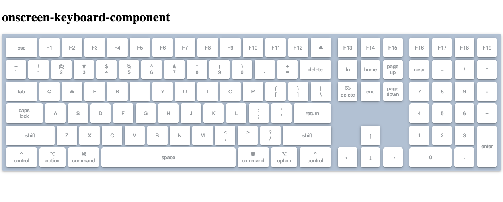
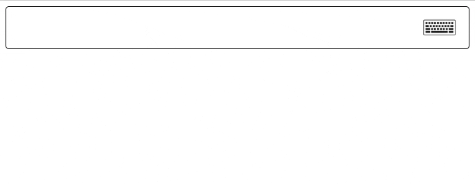

# react-onscreen-keyboard
Responsive on-screen visual keyboard for click, touch, pen, etc.. events.

Visually convey user keypresses.

Subscribe to keypresses programatically.

Dispatch KeyboardEvents programatically.

